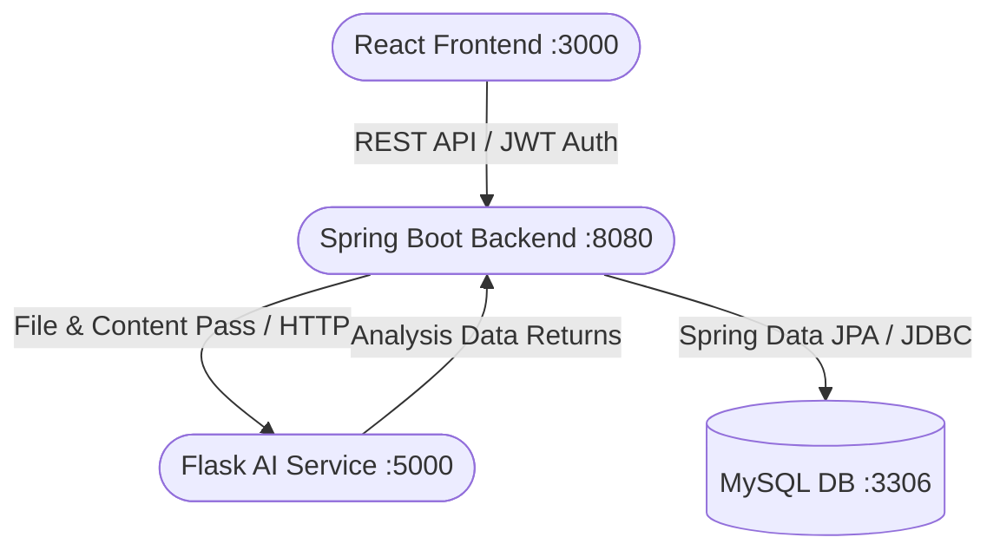

<div align="center">
  
  <h1>🚀 AI-Powered Job Application Tracker</h1>
  <p>A full-stack, comprehensive platform to track job applications, upload resumes, and utilize Advanced AI/NLP to analyze and match resumes dynamically against job descriptions to provide you ATS scoring and feedback.</p>

  <p>
    
    
    
    
    
  </p>
</div>

<br/>

## ✨ Features
- **📊 Interactive Dashboard** — Beautiful SaaS-grade UI with dynamic statistics and interactive `Recharts` graphs depicting your success pipeline.
- **💼 Job Tracker Pipeline** — Create, Read, Update, and Delete capabilities for your individual Job Applications to keep track of interviews and offers.
- **🔐 JWT Secure Authentication** — Robust stateless security via `Spring Security`, encoding passwords utilizing `BCrypt`.
- **📄 Resume Uploads** — Upload `.pdf` or `.docx` format resumes directly bypassing backend handling. Secure file upload system logic allowing users to delete unused templates.
- **🤖 Advanced AI Analytics** — Flask service utilizing `spaCy` NLP extraction and TF-IDF cosine similarity. Returns a comprehensive breakdown:
  - Estimated ATS capability (`0-100` score rating)
  - Keyword and Missing skills extraction against provided Job Descriptions.
  - Actionable feedback generation regarding structure, formats, verb implementations, and explicit tips.

<br/>

## 🏗️ Architecture



<br/>

## 🛠️ Tech Stack & Requirements
| Microservice | Technology | Requirements |
|---|---|---|
| **Frontend UI** | React, Tailwind CSS, Recharts, Axios | NodeJS (v18+) |
| **Backend API** | Java, Spring Boot 3, Spring Security | Java (v17+), Maven |
| **Database** | MySQL 8, JPA/Hibernate mapped | MySQL (v8.0) |
| **AI Inference** | Python, Flask, spaCy, scikit-learn | Python (v3.11+) |

<br/>

## 🚀 Quick Start (Local Setup)
We have provided an automated startup script! 
If you are on Windows, simply ensure your database is running and configured inside `backend/src/main/resources/application.properties`, then run:

```powershell
./start_all.ps1
```
This single script will boot the Python API, Backend API, and Frontend React App concurrently.

---

### Manual Setup Instructions
#### 1. Backend (Spring Boot)
Ensure MySQL is actively listening, and the configuration matches your local user root inside `application.properties`.
```bash
cd backend
mvn clean install
mvn spring-boot:run
```
_Service starts silently at http://localhost:8080. View API Documentation securely at: http://localhost:8080/swagger-ui.html_

#### 2. AI Service (Python NLP)
The AI microservice performs document reading (PDF/DOCX) and natural language processing.
```bash
cd ai-service
pip install -r requirements.txt
python -m spacy download en_core_web_sm
python app.py
```
_AI Service mounts to http://localhost:5000 and can be independently health checked via `/health`._

#### 3. Frontend (React)
Contains the dashboard UI implementation.
```bash
cd frontend
npm install
npm start
```
_Client mounts to http://localhost:3000 where you can directly register or log in._

<br/>

## 📁 Project Structure

```text
Job Simulator/
├── backend/                       # Java / Spring Boot Core API
│   ├── src/main/java/com/jobtracker
│   │   ├── controller/            # Exposed Endpoints (REST)
│   │   ├── service/               # Core Logic & Auth handling
│   │   ├── security/              # Security filter chains & JWT Providers
│   │   └── exception/             # Centralized Custom Exception traps
├── ai-service/                    # Python / Flask Machine Learning API
│   ├── app.py                     # Main Flask pipeline (TF-IDF mapping)
│   └── requirements.txt 
├── frontend/                      # Javascript / React
│   └── src/
│       ├── pages/                 # Full responsive routes (Dashboard, Match)
│       └── components/            # Isolated reusable rendering (Modals, Icons)
├── /database/                     # Reference architecture / seeding scripts
└── start_all.ps1                  # Single-command environment initialization
```

<br/>

<div align="center">
  <i>Produced with ❤️ using Modern Java & Python ecosystem practices.</i>
</div>
